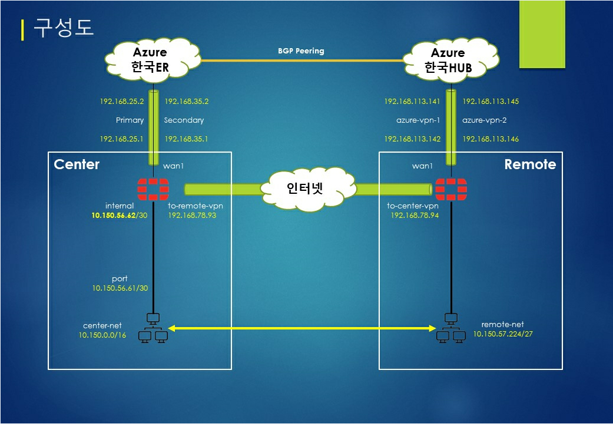

# FortiGate SD-WAN SLA Config


## Remote FortiGate Config

### Remote-SD-WAN #  show vpn ipsec phase1-interface
```
config vpn ipsec phase1-interface
    edit "azure-vpn-1"
        set interface "wan1"
        set ike-version 2
        set keylife 28800
        set peertype any
        set net-device disable
        set proposal 3des-sha1
        set dpd on-idle
        set dhgrp 2
        set remote-gw 20.214.215.254
        set psksecret vpn12345
    next
    edit "azure-vpn-2"
        set interface "wan1"
        set ike-version 2
        set keylife 28800
        set peertype any
        set net-device disable
        set proposal 3des-sha1
        set dpd on-idle
        set dhgrp 2
        set remote-gw 20.249.200.11
        set psksecret vpn12345
    next
    edit "to-center-vpn"
        set interface "wan1"
        set ike-version 2
        set keylife 28800
        set peertype any
        set net-device disable
        set proposal 3des-sha1
        set dpd on-idle
        set dhgrp 2
        set remote-gw 49.50.63.230
        set psksecret vpn12345
    next
end
```

### Remote-SD-WAN #  show vpn ipsec phase2-interface
```
config vpn ipsec phase2-interface
    edit "azure-vpn-1"
        set phase1name "azure-vpn-1"
        set proposal 3des-sha1
        set pfs disable
        set replay disable
        set auto-negotiate enable
        set keylifeseconds 27000
    next
    edit "azure-vpn-2"
        set phase1name "azure-vpn-2"
        set proposal 3des-sha1
        set pfs disable
        set replay disable
        set auto-negotiate enable
        set keylifeseconds 27000
    next
    edit "to-center-vpn"
        set phase1name "to-center-vpn"
        set proposal 3des-sha1
        set pfs disable
        set replay disable
        set auto-negotiate enable
        set keylifeseconds 27000
    next
end
```

### Remote-SD-WAN # show system interface
```
config system interface
    edit "azure-vpn-1"
        set vdom "root"
        set ip 192.168.113.142 255.255.255.255
        set type tunnel
        set tcp-mss 1350
        set remote-ip 192.168.113.141 255.255.255.252
        set interface "wan1"
    next
    edit "azure-vpn-2"
        set vdom "root"
        set ip 192.168.113.146 255.255.255.255
        set allowaccess ping
        set type tunnel
        set tcp-mss 1350
        set remote-ip 192.168.113.145 255.255.255.252
        set interface "wan1"
    next
    edit "to-center-vpn"
        set vdom "root"
        set ip 192.168.78.94 255.255.255.255
        set allowaccess ping
        set type tunnel
        set tcp-mss 1350
        set remote-ip 192.168.78.93 255.255.255.252
        set interface "wan1"
    next
end
```

### Remote-SD-WAN # show router static
```
config router static
    edit 1
        set dst 10.150.56.62 255.255.255.255
        set device "to-center-vpn"
        set link-monitor-exempt enable
    next
    edit 2
        set dst 10.150.56.62 255.255.255.255
        set device "azure-vpn-1"
        set link-monitor-exempt enable
    next
    edit 3
        set dst 10.150.56.62 255.255.255.255
        set device "azure-vpn-2"
        set link-monitor-exempt enable
    next
end
```

### Remote-SD-WAN # show firewall address
```
config firewall address
    edit "10.150.0.0/16"
        set subnet 10.150.0.0 255.255.0.0
    next
    edit "10.150.57.224/27"
        set subnet 10.150.57.224 255.255.255.224
    next
end
```

### Remote-SD-WAN # show firewall addrgrp
```
config firewall addrgrp
    edit "center-net"
        set member "10.150.0.0/16"
    next
    edit "remote-net"
        set member "10.150.57.224/27"
    next
end
```

### Remote-SD-WAN # show firewall policy
```
config firewall policy
    edit 1
        set srcintf "Internal"
        set dstintf "virtual-wan-link"
        set srcaddr "remote-net"
        set dstaddr "center-net"
        set action accept
        set schedule "always"
        set service "ALL"
        set logtraffic all
    next
    edit 2
        set srcintf "Internal"
        set dstintf "wan1"
        set srcaddr "remote-net"
        set dstaddr "all"
        set action accept
        set schedule "always"
        set service "ALL"
        set logtraffic all
        set nat enable
    next
    edit 3
        set srcintf "virtual-wan-link"
        set dstintf "Internal"
        set srcaddr "center-net"
        set dstaddr "remote-net"
        set action accept
        set schedule "always"
        set service "ALL"
        set logtraffic all
    next
end
```

### Remote-SD-WAN # show system virtual-wan-link
```
config system virtual-wan-link
    set status enable
    config members
        edit 1
            set interface "azure-vpn-1"
            set gateway 192.168.113.141
        next
        edit 2
            set interface "azure-vpn-2"
            set gateway 192.168.113.146
        next
        edit 3
            set interface "to-center-vpn"
            set gateway 192.168.78.93
            set cost 50
        next
    end
    config health-check
        edit "10.150.56.62"
            set server "10.150.56.62"
            set sla-fail-log-period 30
            set sla-pass-log-period 60
            set members 1 2 3
            config sla
                edit 1
                    set latency-threshold 100
                    set jitter-threshold 20
                next
            end
        next
    end
    config service
        edit 1
            set name "all"
            set mode sla
            set dst "center-net"
            set src "remote-net"
            config sla
                edit "10.150.56.62"
                    set id 1
                next
            end
            set priority-members 1 2 3
        next
    end
end
```

## Center FortiGate Config

### Center-SD-WAN # show vpn ipsec phase1-interface Remote
```
config vpn ipsec phase1-interface
    edit "to-remote-vpn"
        set interface "wan1"
        set ike-version 2
        set keylife 28800
        set peertype any
        set net-device disable
        set proposal 3des-sha1
        set dpd on-idle
        set dhgrp 2
        set remote-gw 153.156.83.149
        set psksecret vpn12345
    next
end
```

### Center-SD-WAN # show vpn ipsec phase2-interface Remote
```
config vpn ipsec phase2-interface
    edit "to-remote-vpn"
        set phase1name "to-remote-vpn"
        set proposal 3des-sha1
        set pfs disable
        set replay disable
        set auto-negotiate enable
        set keylifeseconds 27000
    next
end
```

### Center-SD-WAN # show vpn ipsec phase2-interface Remote
```
config system interface
    edit "to-remote-vpn"
        set vdom "root"
        set ip 192.168.78.93 255.255.255.255
        set allowaccess ping
        set type tunnel
        set tcp-mss 1350
        set remote-ip 192.168.78.94 255.255.255.252
        set interface "wan1"
    next
end
```

### Center-SD-WAN # show router static
```
config router static
    edit 1
        set dst 10.150.57.224 255.255.255.224
        set device "to-remote-vpn"
    next
end
```

### Center-SD-WAN # show firewall address
```
config firewall address
    edit "Remote_192.168.78.94/32"
        set subnet 192.168.113.142 255.255.255.255
    next
    edit "Remote_192.168.113.142/32"
        set subnet 192.168.113.142 255.255.255.255
    next
    edit "Remote_192.168.113.146/32"
        set subnet 192.168.113.146 255.255.255.255
    next
    edit "Remote_10.150.57.224/27"
        set subnet 10.150.57.224 255.255.255.224
    next
end
```

### Center-SD-WAN # show firewall addrgrp
```
config firewall addrgrp
    edit "remote-net"
        set member "Remote_192.168.78.94/32" "Remote_192.168.113.142/32" "Remote_192.168.113.146/32" "Remote_10.150.57.224/27"
    next
    edit "center-net"
        set member "10.150.0.0/16"
    next
end
```

### Center-SD-WAN # show firewall policy
```
config firewall policy
    edit 1
        set srcintf "to-remote-vpn"
        set dstintf "internal"
        set srcaddr "remote-net"
        set dstaddr "center-net"
        set action accept
        set schedule "always"
        set service "ALL"
        set logtraffic all
    next
    edit 2
        set srcintf "internal"
        set dstintf "to-remote-vpn"
        set srcaddr "center-net"
        set dstaddr "remote-net"
        set action accept
        set schedule "always"
        set service "ALL"
        set logtraffic all
    next
end
```
